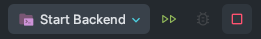

# Hello Plog Web Server! 👋
Plog는 개발자들의 커리어 관리 플랫폼으로 블로깅, 및 커리어 관리를 손쉽게 처리하는 것을 중점으로 개발 되었습니다.

# How To Run
Plog는 대부분의 세팅을 AWS Secrets Manager를 통해 사용합니다.

따라서 Plog가 관리하는 AWS 콘솔 관리자 권한이 있어야 원활한 구동이 가능합니다.


## 1. Install AWS Secrets Generator
1. [aws-secret-gen](https://github.com/YangTaeyoung/aws-secret-gen)의 `README.md`을 참조하여 AWS Secrets Generator를 설치합니다.
2. 다음 명령어를 수행합니다.
    ```bash
    $ aws-secret-gen -o ./src/main/resources/application-local.yaml
    ```
3. 사전 공유된 AWS Access Key ID와 AWS Secret Access Key를 입력합니다. (2번째 호출부터는 따로 해당 값의 입력을 요구하지 않습니다.) 
    ```bash
    > Enter AWS Access Key ID: {AWS Access Key ID}
    > Enter AWS Secret Access Key: {AWS Secret Access Key}
    ```
4. 어떤 secret을 선택할 지 선택하는 창이 나옵니다. 이중 `plog-back/config/application-local.yaml`을 선택합니다. 
    ```bash
    > ? Select Secret:
    > ...
    > ▸ plog-back/config/application-local.yaml
    ```
5. `Enter`를 누르면 `./src/main/resources/application-local.yaml`에 AWS Secrets Manager에서 가져온 값이 2번에서 설정한 경로로 입력됩니다.

## 2. Bastion SSH Host 설정하기
1. Plog에서 사용 중인 RDS, Elastic Cache의 경우 Private Subnet에 위치하고 있습니다. 따라서 Bastion Host를 통해 접속해야 합니다.
2. Bastion의 SSH Config를 얻기위해 `aws-secret-gen`을 다음과 같이 실행합니다. (⚠️ 이미 .ssh/config 파일이 존재할 경우 해당 파일을 대체하므로, 기존의 설정을 백업하거나 다른 경로로 설정해주세요.)
    ```bash
    $ aws-secret-gen -o ~/.ssh/config
    ```
3. 리스트 중 `plog/bastion/ssh-config`를 선택합니다.
   ```bash
       > ? Select Secret:
       > ...
       > ▸ plog/bastion/ssh-config
   ```
4. `Enter`를 누르면 `~/.ssh/config`에 AWS Secrets Manager에서 가져온 값이 2번에서 설정한 경로로 입력됩니다.
   - 2에서 백업한 경우 기존의 설정을 `~/.ssh/config` 하단에 다시 추가해주세요
5. Private Key 역시 AWS Secrets Manager를 통해 관리합니다. 다음 명령어를 수행합니다.
    ```bash
    $ aws-secret-gen -o ~/.ssh_key/plog-bastion.pem
    ```
6. 리스트 중 `plog/bastion/private-key`를 선택합니다.
    ```bash
         > ? Select Secret:
         > ...
         > ▸ plog/bastion/private-key
    ```
7. `Enter`를 누르면 `~/.ssh_key/plog-bastion.pem`에 AWS Secrets Manager에서 가져온 값이 2번에서 설정한 경로로 입력됩니다.

## 3. Build & Run
1. InteliJ의 Run Configuration에 다음과 같은 설정이 추가되어 있는지 확인합니다.


2. `Start Backend`를 선택하여 실행합니다.

